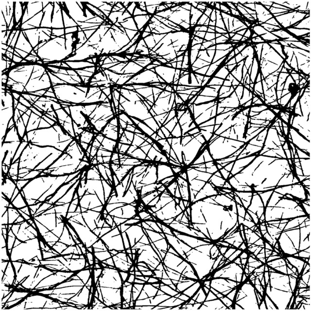

User Guide
==========

A basic workflow of bimato includes loading some 3D image data into a numpy ndarray, calling one of the algorithms provided and storing or plotting the gained data. This tutorial illustrates the a typical workflow to calculate pore-sizes of a Leica LIF image utilizing a third-party python library.

For the sake of clarity, this tutorial analyzes a 2D image. This makes understanding the algorithm and analysis steps a lot easier for the reader. You can find a 3D rendering at the bottom of the page.

Load Data
---------

The first step is to load some 3D image data of a biopolymer network as a numpy ndarray. In this tutorial, we will use some LSM image of a fluorescently stained collagen scaffold, recorded using a Leica SP8 LSM. White areas are the fluid phase, black represents stained collagen fibers:

We begin by utilizing the third-party library `readlif <https://pypi.org/project/readlif/>`__ to conveniently load a single Leica LIF image:

..  code-block:: python

    from readlif.reader import LifFile
    import bimato

    lif_file = LifFile("/path/to/sample.lif")
    lif_image = lif_file.get_image(0)

and read a specific 2D image as a numpy ndarray:

..  code-block:: python

    data = lif_image.get_frame(z=0, t=0, c=0)

There is a convenience function to load a 3D image under :func:`bimato.utils.read_lif_image`:

..  code-block:: python

    data = bimato.utils.read_lif_image(lif_image)

If the image data has a lot of noise, we can *optionally* denoise the loaded image using
:func:`bimato.utils.denoise_image`:

..  code-block:: python

    data = bimato.utils.denoise_image(data)

Segmentation
------------

We than perform the first fundamental step of image segmentation, where we classify our image into fluid and polymer phase. This is done using bimato's custom algorithm as published in our `article`_:

..  code-block:: python

    bw = bimato.get_binary(data)

resulting in such a segmentation binary image:

This binary image is the basis for almost all bimato algorithms, such as pore-size, fiber thickness and network structure.

Pore-Size
---------

In this tutorial, we will calculate the pore-size of the collagen scaffold using :func:`bimato.get_pore_sizes <bimato.poresize.get_pore_sizes>`. It takes a binary image of fluid and polymer phase and the respective image sampling. The parameter ``sampling`` needs to be a python dictionary containing the physical pixel size in each *x*, *y* and *z* direction. In this example, we used `readlif <https://pypi.org/project/readlif/>`__, which conveniently reads this kind of meta-data for us as an ``info`` property of the ``lif_image``. Keep in mind that :func:`bimato.get_pore_sizes <bimato.poresize.get_pore_sizes>` expects the physical size in each direction as in "microns per pixel", not as a scale factor as in "pixel per microns"! Providing the binary image ``bw`` and correct ``sampling``, we receive a :class:`pandas.DataFrame`:

..  code-block:: python

    sampling = {
        'x': 1/lif_image.info["scale"][0],
        'y': 1/lif_image.info["scale"][1],
        'z': 1/lif_image.info["scale"][2]
    }

    df = bimato.get_pore_sizes(binary=bw, sampling=sampling)

This DataFrame contains every calculated data in several columns. Below is a comprehensive list of all columns and the meaning behind each:

+-----------------------------+-------------------------------------------------------------------------------------------------------------+
| column                      | data                                                                                                        |
+=============================+=============================================================================================================+
| x [px]                      | x coordinate in pixel                                                                                       |
+-----------------------------+-------------------------------------------------------------------------------------------------------------+
| y [px]                      | y coordinate in pixel                                                                                       |
+-----------------------------+-------------------------------------------------------------------------------------------------------------+
| z [px]                      | z coordinate in pixel                                                                                       |
+-----------------------------+-------------------------------------------------------------------------------------------------------------+
| Diameter [µm]               | pore diameter                                                                                               |
+-----------------------------+-------------------------------------------------------------------------------------------------------------+
| Residual Degree             | number of iterative pore detections, 0 for first step, 1 for second                                         |
+-----------------------------+-------------------------------------------------------------------------------------------------------------+
| Size x [px]                 | total x size of 3D image                                                                                    |
+-----------------------------+-------------------------------------------------------------------------------------------------------------+
| Size y [px]                 | total y size of 3D image                                                                                    |
+-----------------------------+-------------------------------------------------------------------------------------------------------------+
| Size z [px]                 | total z size of 3D image                                                                                    |
+-----------------------------+-------------------------------------------------------------------------------------------------------------+
| PhysicalSize x              | pixel-micron conversion factor used                                                                         |
+-----------------------------+-------------------------------------------------------------------------------------------------------------+
| PhysicalSize y              | pixel-micron conversion factor used                                                                         |
+-----------------------------+-------------------------------------------------------------------------------------------------------------+
| PhysicalSize z              | pixel-micron conversion factor used                                                                         |
+-----------------------------+-------------------------------------------------------------------------------------------------------------+
| Number Of Pores             | total number of detected pores in sample                                                                    |
+-----------------------------+-------------------------------------------------------------------------------------------------------------+
| Cube Volume [µm³]           | physical volume of 3D image                                                                                 |
+-----------------------------+-------------------------------------------------------------------------------------------------------------+
| Single Pore Volume [µm³]    | volume of detected pore                                                                                     |
+-----------------------------+-------------------------------------------------------------------------------------------------------------+
| Real Pore Volume [µm³]      | physical volume occupied by detected pores, without overlapping of individual pores                         |
+-----------------------------+-------------------------------------------------------------------------------------------------------------+
| Collagen Volume [µm³]       | volume of the polymer phase                                                                                 |
+-----------------------------+-------------------------------------------------------------------------------------------------------------+
| Fluid Volume [µm³]          | volume of the fluid phase                                                                                   |
+-----------------------------+-------------------------------------------------------------------------------------------------------------+
| Single Pore Volume Fraction | space occupied in relation to the sample volume                                                             |
+-----------------------------+-------------------------------------------------------------------------------------------------------------+
| Real Pore Volume Fraction   | space occupied in relation to the sample volume                                                             |
+-----------------------------+-------------------------------------------------------------------------------------------------------------+
| Collagen Volume Fraction    | space occupied in relation to the sample volume                                                             |
+-----------------------------+-------------------------------------------------------------------------------------------------------------+
| Fluid Volume Fraction       | space occupied in relation to the sample volume                                                             |
+-----------------------------+-------------------------------------------------------------------------------------------------------------+
| Zeta Single Pores           | pore diameter scaled with its corresponding column fraction                                                 |
+-----------------------------+-------------------------------------------------------------------------------------------------------------+
| Zeta Real Pores             | pore diameter scaled with its corresponding column fraction                                                 |
+-----------------------------+-------------------------------------------------------------------------------------------------------------+
| Zeta Collagen               | pore diameter scaled with its corresponding column fraction                                                 |
+-----------------------------+-------------------------------------------------------------------------------------------------------------+
| Zeta Fluid                  | pore diameter scaled with its corresponding column fraction                                                 |
+-----------------------------+-------------------------------------------------------------------------------------------------------------+
| Pseudo Pore Diameter [µm]   | theoretical pore diameter calculated by assuming that all detected pores would occupy the fluid-phase fully |
+-----------------------------+-------------------------------------------------------------------------------------------------------------+

Each row of the DataFrame contains exactly one found pore. The most interesting value might be ``Diameter [µm]``, which is the diameter of the fitted sphere or in other words the "pore" that has been detected. As published in our article_, bimato calculates an exceptionally precise amount of pores with a huge coverage of fluid phase volume:

This is illustrated in the image above, where blue pores represent detected pores in the first analysis step, and orange pores represent additional pores detected in a second analysis step, providing a much higher coverage.

Exemplary analysis workflow
---------------------------

Usually, we have for example different collagen scaffolds and want to compare their pore-sizes. For this, we would load several images, calculate their pore-sizes and plot them. Below is an exemplary workflow for this:

- load each image in the LIF file
- analyze it
- extract meta-data such as collagen concentration from image name
- concatenate this data to global DataFrame
- plot comparison boxplot

..  code-block:: python

    import pandas as pd
    from readlif.reader import LifFile
    import seaborn as sns
    import bimato

    lif_file = LifFile("/path/to/sample.lif")

    df_poresize = list()
    for lif_image in lif_file.get_iter_image():

        data = bimato.utils.read_lif_image(lif_image)
        bw = bimato.get_binary(data)

        sampling = {
            'x': 1/lif_image.info["scale"][0],
            'y': 1/lif_image.info["scale"][1],
            'z': 1/lif_image.info["scale"][2]
        }

        df_tmp = bimato.get_pore_sizes(binary=bw, sampling=sampling)

        df_tmp['Concentration [g/l]'] = lif_image.name
        df_poresize.append(df_tmp)

    df_poresize = pd.concat(df_poresize)

    g = sns.catplot(
        data=df_poresize,
        kind='box',
        x='Concentration [g/l]',
        y='Diameter [µm],
    )
    g.set_ylabels("Pore-size [µm]")

Resulting in the following plot:

.. image:: poresize_m.jpeg
  :width: 200
  :align: center
  :alt: boxplot of poresize between two differently concengtrated collagen matrices

.. _article: https://www.nature.com/articles/s41598-019-44764-5